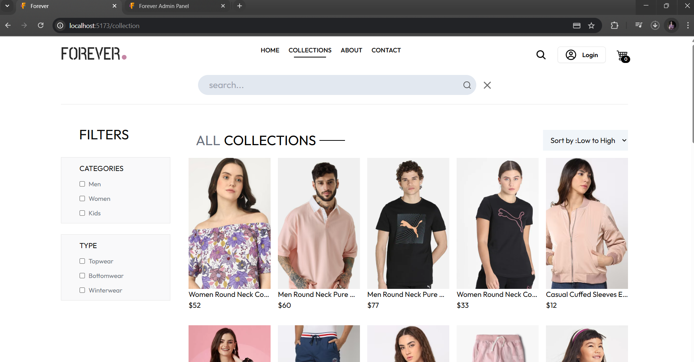
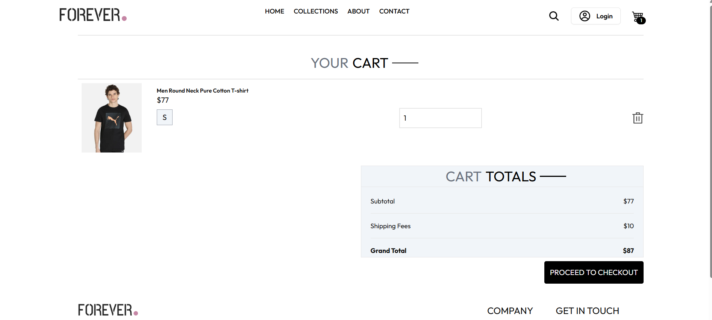
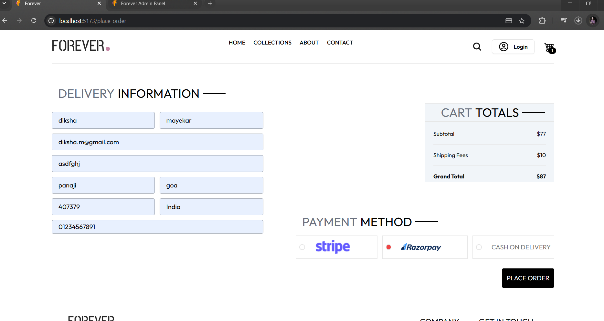
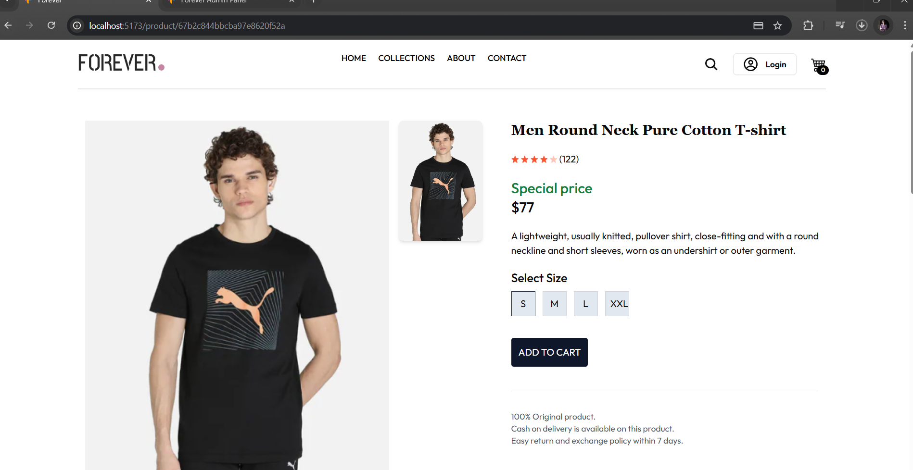
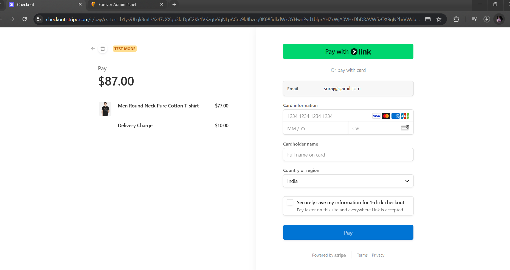
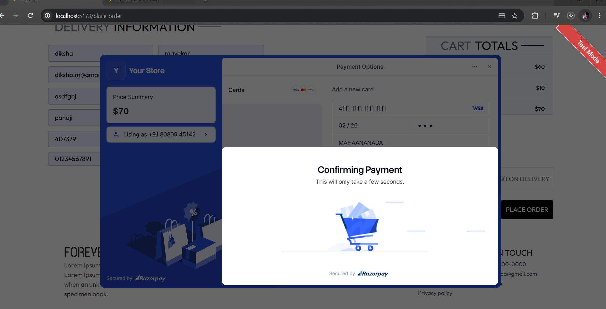
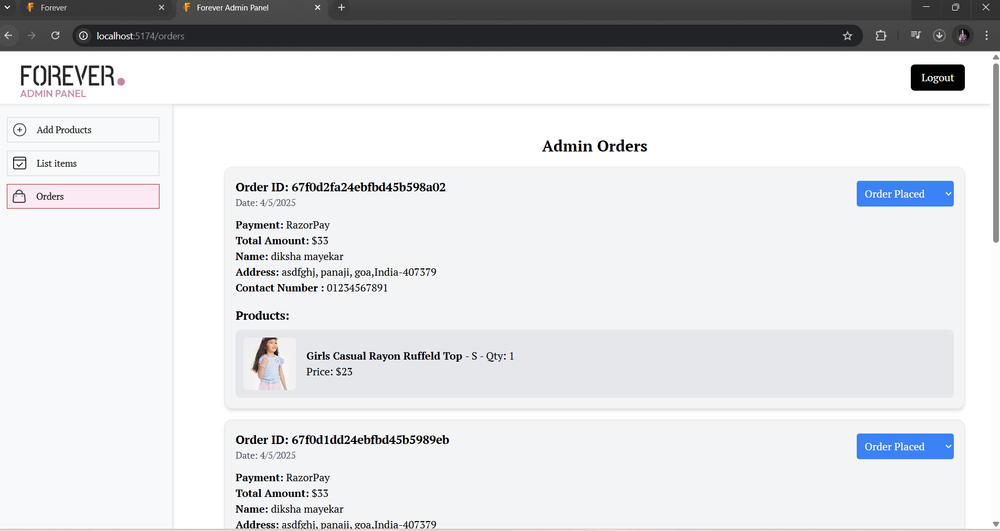
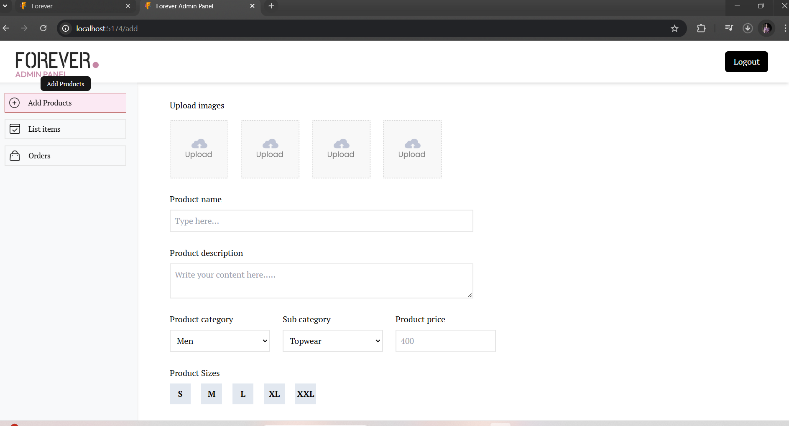

# 🛍️ eCommerce Web Application (MERN Stack)

A full-featured **eCommerce web application** built using the **MERN Stack**: **MongoDB**, **Express.js**, **React.js**, and **Node.js**, featuring full **admin control**, **product filtering**, a **shopping cart**, and **online payment integration**.

▶️ [Watch Demo Video on YouTube](https://youtu.be/iOHhxlb_T3g?si=ySbEeFuaQhfIP67C)

---

## 🖥️ Frontend (React.js + Tailwind CSS)

- ⚡ Responsive UI built with **React.js** and **Tailwind CSS**
- 🔍 Product listing with **filtering and sorting**
- 📦 Product variant selection (e.g., size)
- 🛒 Real-time cart functionality
- ✅ Checkout process includes:
  - 📮 Delivery address form
  - 💰 Payment method selection (Cash on Delivery or Online Payment)
- 🔐 Integrated with **Stripe** and **Razorpay** for secure online payments

### 📸 UI Screenshots

---

## 🛒 Admin Panel

- 🔐 Secure admin login
- ⬆️ Upload new products (title, price, images, variants, etc.)
- 🗑️ Delete or update existing products
- 🧾 View all products in the store
- 📦 View and manage customer orders

### 📸 Admin Panel Screenshots

---

## 🛠️ Backend (Node.js + Express.js + MongoDB)

- 🧩 RESTful API built using **Express.js**
- 🗃️ **MongoDB** for database management (Products, Users, Orders)
- 🔐 JWT-based **authentication and authorization**
- 📦 Handles:
  - Product retrieval, creation, update, and deletion
  - User registration and login
  - Order creation and tracking
  - Payment session creation with Stripe & Razorpay
- 🧪 Environment variables managed securely using `.env` for sensitive keys

---
